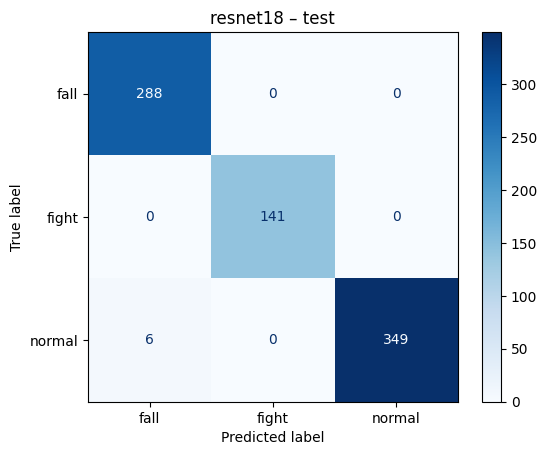
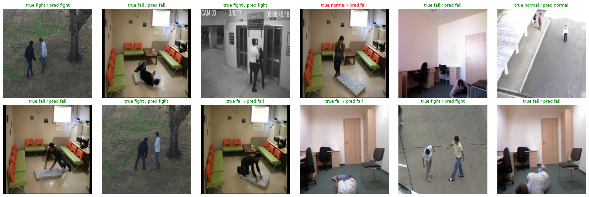
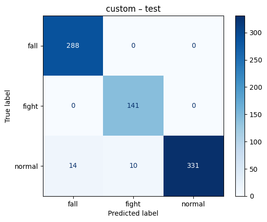

# Abnormal Crowd Behavior Detection with 2D CNNs

Frame-level classification of surveillance images into **normal**, **fall** and **fight** using 2D convolutional neural networks.

> Part of the [DL-proj](https://github.com/anikagupta2403/DL-proj) comparison of 2D CNN, 3D CNN and Transformer models. See `main` for the project overview.

| | |
|---|---|
| Model 1 run (ResNet-18) | [`2d_cnn_resnet18.ipynb`](2d_cnn_resnet18.ipynb) → weights `best_resnet18.pt` |
| Model 2 run (Custom CNN) | [`2d_cnn_custom.ipynb`](2d_cnn_custom.ipynb) → weights `best_custom_2d_cnn.pt` |
| Figures | [`results/`](results/) |

Both runs were done on Kaggle (GPU) with the same data pipeline, split and seed.

---

## 1. Dataset

**Source:** [Roboflow Universe – Abnormal Behavior Detection v1](https://universe.roboflow.com/abnormal-behavior-detection/abnormal-behavior-detection-5geje/dataset/1) (CC BY 4.0), exported in YOLOv8 format.
It has 3,709 images, already resized to 640×640 by Roboflow, with no augmentation. The frames come from several public surveillance and fall-detection video sets, including UR Fall (`fall-xx-cam0`, `adl-xx-cam0`) and fight sequences (`seqN-frame_*`, `fiNNN-frame_*`).

### Preprocessing pipeline

```
Raw dataset (Roboflow export, YOLOv8 format)          3,709 images
  ↓ Data loading            parse data.yaml + one YOLO label file per image
  ↓ Data cleaning           corrupt-image check; remap unnamed classes 0/1/2
  ↓ Duplicate removal       drop 109 byte-identical images (MD5)             → 3,600
  ↓ Annotation validation   label format and box range checks; drop 1 empty label → 3,599
  ↓ Class handling          6 raw classes → 3; check balance; class-weighted loss
  ↓ Resizing                640×640 → 224×224
  ↓ Normalization           pixels scaled to [0, 1], then ImageNet mean/std
  ↓ Augmentation            flip, colour jitter, random crop (train set only)
  ↓ Train / Val / Test      group-aware split by source video
Final dataset                                          3,599 images
```

**1. Data cleaning and annotation validation.** The validation cell produced:

| Check | Result |
|---|---|
| Corrupt or unreadable images | 0 |
| Bounding boxes checked | 7,357 |
| Malformed label lines | 0 |
| Out-of-range boxes (coords outside [0, 1]) | 0 |
| Empty label files | 1 (dropped) |
| Exact duplicate images removed | **109** |
| Near-duplicate clusters (256-bit dHash) | 63 |
| Near-duplicate clusters spanning more than one video group | 15 |

The 109 exact duplicates are frames Roboflow exported twice under different hashes. Near-duplicate *consecutive* frames are not deleted; the group-aware split (step 4) handles them. Of the 15 clusters that span groups, 14 are frames from *different* UR Fall daily-activity videos shot by the same fixed camera in the same room. The remaining one is two adjacent frames on either side of a 100-frame block boundary.

**2. Class merging.** `data.yaml` lists 6 classes: `['0', '1', '2', 'fall', 'fight', 'normal']`. Looking at the images and how labels co-occur shows that the numbered classes are a second annotation scheme for the same behaviors: `0 → normal`, `1 → fall`, `2 → fight` (see [`results/label_sanity_check.png`](results/label_sanity_check.png)).

**3. One label per image.** If any box in the image is *fight*, the image is labeled **fight**. Otherwise, if any box is *fall*, it is **fall**. Otherwise it is **normal**. After cleaning, the classes are balanced: **1,200 fall / 1,199 fight / 1,200 normal**.

**4. Splitting by video.** Roboflow's original train/valid split alternates consecutive frames from the same clips (frame 4 → train, 15 → valid, 20 → train, …), so near-duplicate frames appear on both sides and inflate validation scores. We grouped the images by source video (218 groups). The two long numbered sequences have no video ID, so we cut them into blocks of 100 consecutive frames. We then split with `StratifiedGroupKFold` (≈ 60 / 20 / 20) so that **no video is in more than one split**.

| Split | fall | fight | normal | Total |
|---|---|---|---|---|
| Train | 668 | 725 | 681 | 2,074 |
| Validation | 244 | 333 | 164 | 741 |
| Test | 288 | 141 | 355 | 784 |
| **Total** | 1,200 | 1,199 | 1,200 | 3,599 |

Videos differ in length, and whole videos must stay in one split, so the per-split class proportions are uneven even though the full dataset is balanced.

### Resizing, normalization and augmentation
- **Resizing:** 224×224, the standard input size for ResNet-style CNNs. Roboflow's 640×640 is meant for YOLO detection.
- **Normalization:** `ToTensor()` scales pixels to [0, 1], then ImageNet mean/std normalization is applied, which the pretrained ResNet expects.
- **Augmentation (training only):** `RandomResizedCrop(224, scale=(0.6, 1.0))`, `RandomHorizontalFlip`, `ColorJitter(0.3, 0.3, 0.3, 0.05)` (brightness, contrast, saturation, hue). Validation and test images are only resized and normalized.
- **Mosaic augmentation was not used.** Mosaic stitches 4 images into one. That works for object detection, where every box keeps its own label, but in image classification the stitched image could contain normal, fall and fight at once and would have no single correct label.

---

## 2. Implemented Models

### Model 1: ResNet-18 (ImageNet-pretrained, fine-tuned)

**Why we selected it**
- The dataset is small (~2.1k training images). Transfer learning from ImageNet gives the model general visual features (edges, textures, human shapes and poses) that it would otherwise have to learn from very little data.
- ResNet-18 is a well-understood baseline. At 11.2M parameters it is light enough to fine-tune in a few minutes on a Kaggle T4 GPU.
- Its residual connections keep training stable when the whole network is fine-tuned.

**How it works**
- It is a deep 2D CNN made of residual blocks. Each block learns a residual function *F(x)* and outputs *F(x) + x*. This identity shortcut lets gradients pass straight through the block, which avoids the vanishing-gradient problem in deep networks.
- **Structure:** a 7×7 convolution stem and max-pool, then 4 stages of 2 BasicBlocks each (64 → 128 → 256 → 512 channels, with resolution halved at each stage), then global average pooling and a fully connected layer.
- **Our change:** we replaced the 1000-class ImageNet head with `Dropout(0.3) → Linear(512, 3)` and fine-tuned the whole network end to end.

**Implementation**
```python
m = torchvision.models.resnet18(weights=torchvision.models.ResNet18_Weights.DEFAULT)
m.fc = nn.Sequential(nn.Dropout(0.3), nn.Linear(m.fc.in_features, len(CLASSES)))
```

**Parameters used**

| Hyperparameter | Value |
|---|---|
| Input size | 224 × 224 × 3 |
| Trainable parameters | 11.18 M |
| Epochs | 15 |
| Batch size | 32 |
| Optimizer | AdamW, weight decay 1e-4 |
| Learning rate | 3e-4 (max), OneCycle schedule |
| Loss | Cross-entropy, class-weighted, label smoothing 0.05 |
| Precision | Mixed (AMP, fp16) |
| Checkpoint selection | Best validation macro-F1 (epoch 9, val macro-F1 = 0.988) |
| Seed | 42 |

**Preliminary results**

Training converged quickly: validation macro-F1 was 0.96 after the first epoch and peaked at 0.988 at epoch 9 ([curves](results/resnet18_training_curves.png)).

Test set (784 images, from videos the model never saw):

| Class | Precision | Recall | F1 | Support |
|---|---|---|---|---|
| fall | 0.980 | 1.000 | 0.990 | 288 |
| fight | 1.000 | 1.000 | 1.000 | 141 |
| normal | 1.000 | 0.983 | 0.991 | 355 |
| **Macro avg** | **0.993** | **0.994** | **0.994** | 784 |
| **Accuracy** | | | **0.992** | 784 |

Confusion matrix (rows are the true class):

| | pred fall | pred fight | pred normal |
|---|---|---|---|
| **fall** | 288 | 0 | 0 |
| **fight** | 0 | 141 | 0 |
| **normal** | 6 | 0 | 349 |



Only 6 of 784 test frames are misclassified, all of them **normal → fall**. Every fall and fight frame is detected.

Sample test predictions (green = correct, red = wrong):



The one error in this sample (top row, 4th) is a person **standing** next to the mattress in a fall-dataset room. The model predicts *fall*, which suggests the room and the mattress, not the pose, drove the decision.

---

### Model 2: Custom 2D CNN (trained from scratch)

**Why we selected it**
- It is a baseline with no pretraining. Comparing it with Model 1 shows how much of the performance comes from ImageNet transfer learning and how much the task can be learned from this dataset alone.
- Each layer is simple enough to explain and analyze, and at about 1.17M parameters it is roughly 10× smaller than ResNet-18. That makes it a candidate for real-time use on edge surveillance hardware.

**How it works**
- It follows a VGG-style design: 4 convolutional blocks, each with two 3×3 convolutions, BatchNorm and ReLU, followed by 2×2 max-pooling. The channels double at each block (32 → 64 → 128 → 256) while the spatial resolution halves (224 → 14).
- Stacking 3×3 convolutions grows the receptive field cheaply: early blocks respond to edges and textures, later blocks to body parts and poses. BatchNorm stabilizes training from random initialization.
- The head uses global average pooling, `Dropout(0.3)` and `Linear(256, 3)`. Global average pooling keeps the parameter count low and reduces overfitting compared with large fully connected layers.

**Implementation**
```python
class SmallCNN(nn.Module):
    def __init__(self, n_classes):
        super().__init__()
        def block(i, o): return nn.Sequential(
            nn.Conv2d(i, o, 3, padding=1, bias=False), nn.BatchNorm2d(o), nn.ReLU(inplace=True),
            nn.Conv2d(o, o, 3, padding=1, bias=False), nn.BatchNorm2d(o), nn.ReLU(inplace=True),
            nn.MaxPool2d(2))
        self.features = nn.Sequential(block(3, 32), block(32, 64), block(64, 128), block(128, 256))
        self.head = nn.Sequential(nn.AdaptiveAvgPool2d(1), nn.Flatten(), nn.Dropout(0.3), nn.Linear(256, n_classes))
    def forward(self, x): return self.head(self.features(x))
```

**Parameters used**

| Hyperparameter | Value |
|---|---|
| Input size | 224 × 224 × 3 |
| Trainable parameters | 1.17 M |
| Epochs | 40 |
| Batch size | 32 |
| Optimizer | AdamW, weight decay 1e-4 |
| Learning rate | 3e-4 (max), OneCycle schedule |
| Loss | Cross-entropy, class-weighted, label smoothing 0.05 |
| Precision | Mixed (AMP, fp16) |
| Checkpoint selection | Best validation macro-F1 (epoch 21, val macro-F1 = 0.944) |
| Data split and augmentation | Same as Model 1 |

**Preliminary results**

Training was slower and noisier than for ResNet-18. Validation macro-F1 rose from 0.80 (epoch 1) to about 0.90 by epoch 10, then fluctuated between 0.85 and 0.94. It peaked at 0.944 at epoch 21, while training accuracy kept rising to 0.99 ([curves](results/custom_cnn_training_curves.png)).

Test set (784 images):

| Class | Precision | Recall | F1 | Support |
|---|---|---|---|---|
| fall | 0.954 | 1.000 | 0.976 | 288 |
| fight | 0.934 | 1.000 | 0.966 | 141 |
| normal | 1.000 | 0.932 | 0.965 | 355 |
| **Macro avg** | **0.962** | **0.977** | **0.969** | 784 |
| **Accuracy** | | | **0.969** | 784 |

Confusion matrix (rows are the true class):

| | pred fall | pred fight | pred normal |
|---|---|---|---|
| **fall** | 288 | 0 | 0 |
| **fight** | 0 | 141 | 0 |
| **normal** | 14 | 10 | 331 |



All 24 errors are **normal frames flagged as abnormal** (14 as fall, 10 as fight). Like ResNet-18, it never misses a fall or a fight.

Sample test predictions (same 12 test images as Model 1; green = correct, red = wrong):


On this sample, the custom CNN makes the same predictions as ResNet-18, including the same normal → fall error on the standing person in the fall room.

The run was repeated in a separate Kaggle session with the same seed and config. It reproduced every epoch's metrics and the test results exactly.

---

### Model comparison

| | ResNet-18 (pretrained) | Custom CNN (from scratch) |
|---|---|---|
| Parameters | 11.18 M | 1.17 M |
| Weights file | 44.8 MB | 4.7 MB |
| Epochs (best epoch) | 15 (9) | 40 (21) |
| Best val macro-F1 | 0.988 | 0.944 |
| **Test accuracy** | **0.992** | 0.969 |
| **Test macro-F1** | **0.994** | 0.969 |
| Test errors | 6 / 784 | 24 / 784 |
| Recall on fall / fight | 1.000 / 1.000 | 1.000 / 1.000 |
| Normal recall (false-alarm side) | 0.983 | 0.932 |

- **Transfer learning helps, but by less than expected.** ImageNet pretraining gives about 2.5 points of macro-F1, 4× fewer errors, and much faster, more stable convergence. Still, a 1.17M-parameter network trained from scratch on ~2k images reaches 0.969. That suggests the classes are visually easy to separate in this dataset (see Limitations).
- **Both models fail the same way.** Neither misses an abnormal event; all errors are false alarms on normal frames. For surveillance this is the safer kind of error.
- **The custom CNN overfits more.** Its training accuracy reaches 0.99 while validation stays around 0.90–0.94, and its validation scores swing more from epoch to epoch.

---

## 3. Evaluation Metrics

Both models use the same group-aware test split (784 images), which contains videos not seen during training or model selection.

- **Accuracy** is the fraction of correctly classified frames. It can hide weak performance on one class, especially because the test split's class mix is uneven (141 fight vs. 355 normal).
- **Precision (per class)** is TP / (TP + FP): of the frames flagged as *fight*, how many really are fights. Low precision means false alarms.
- **Recall (per class)** is TP / (TP + FN): of the real *fight* frames, how many the model caught. In surveillance, missing an incident (low recall on abnormal classes) usually costs more than a false alarm.
- **F1-score** is the harmonic mean of precision and recall.
- **Macro-F1** is the unweighted mean of the per-class F1 scores. It is the **main metric** and is also used to pick the best checkpoint, because it weights every class equally.
- **Confusion matrix** shows which classes get confused with each other, e.g. normal → fall for both models.

---

## 4. Limitations

- **The dataset has no crowd panic class.** It covers falls and fights, which are individual or small-group abnormal behaviors. The models detect *abnormal behavior* in general, and a dedicated crowd panic dataset (e.g. UMN, or the escape scenes in ShanghaiTech) would be needed for that specific task.
- **Scene can give away the class.** Most fall frames come from a few indoor rooms and most fight frames from outdoor scenes, so a CNN can partly rely on the background instead of the behavior. The group split prevents identical clips from leaking across splits, but scenes still repeat across clips (e.g. the UR Fall room shared by many videos). Both models' shared error in the sample predictions, a person standing in a fall room predicted as *fall*, is an example of this. This may explain the near-perfect scores and why even the small from-scratch CNN does well. The scores should not be read as proof that the models generalize to new cameras.
- **Small, uneven test split.** The test split has only 141 fight frames, from a limited number of videos, so per-class scores can change by a few points with a different split.
- **No temporal information.** A 2D CNN sees one frame at a time, while panic, fights and falls are defined by motion.

---

## 5. How to Reproduce

1. Download the dataset from Roboflow (format: **YOLOv8**) and upload it as a Kaggle dataset.
2. Open the notebook on Kaggle, set **Accelerator → GPU**, and point `DATA_ROOT` at the dataset:
   - Model 1: `2d_cnn_resnet18.ipynb` (`MODEL = "resnet18"`, `EPOCHS = 15`, `LR = 3e-4`)
   - Model 2: `2d_cnn_custom.ipynb` (`MODEL = "custom"`, `EPOCHS = 40`, `LR = 3e-4`)
3. Click **Run All**. The best checkpoint is saved as `best.pt`.

Requirements: Python 3, PyTorch, torchvision, scikit-learn, pandas, matplotlib, Pillow, PyYAML (all preinstalled on Kaggle).
